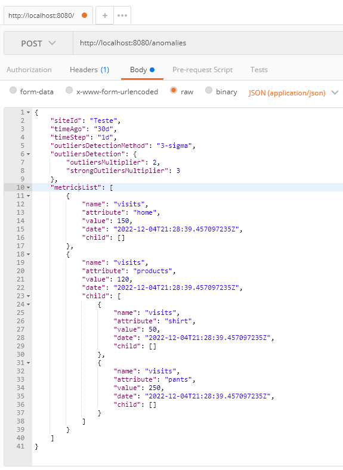
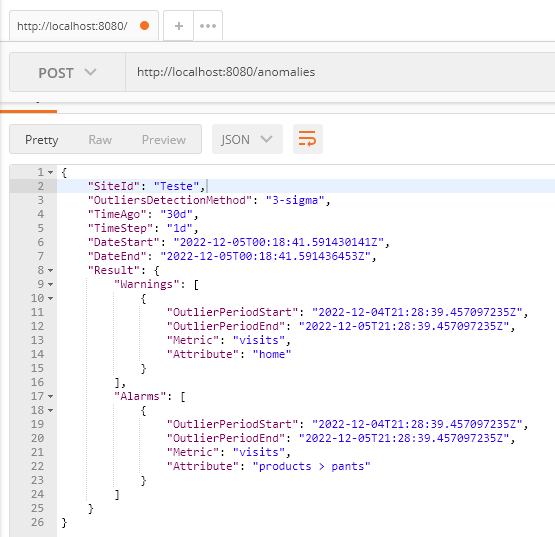

# Anomalies Detection

Was created an http server to receive the data and return the anomalies detected.

## 💻 Required

* go version 1.19

## 🚀 Installing Anomalies Detection

To install the Anomalies Detection, follow the steps:

Linux, MacOS e Windows:
```
go mod tidy
```

## ☕ Using

To use Anomalies Detection, follow the steps:

Run the rest server
```
go run cmd/main.go
```

Now it is possible access the application by the port 8088, follow the exemple to check anomalies:
 ```
http://localhost:8080/anomalies
 ```

  ## Example
Request:



Response:



  ## ☕ Testing

To run all the unit tests, follow the step:

```
go test -cover -race ./...
```

[⬆ back to top](#Anomalies Detection)<br>